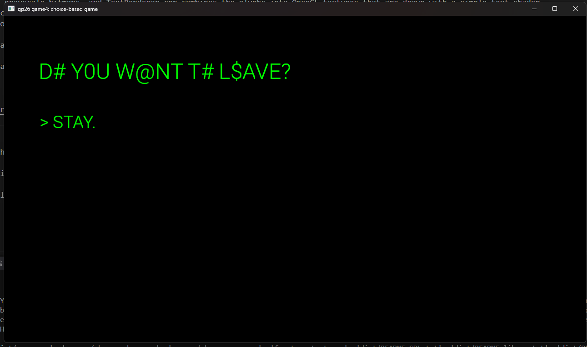

# LEAVE

Author: Jiawei Li

Design: A terminal-style choice game where the interface begins to resist the player's decisions. Choosing to leave causes the choices and text to glitch and change, turning the interface itself into part of the game.

Text Drawing: Text is rendered at runtime using HarfBuzz and FreeType. HarfBuzz shapes UTF-8 strings into positioned glyphs, FreeType rasterizes those glyphs into grayscale bitmaps, and TextRenderer.cpp combines the glyphs into OpenGL textures that are drawn with a simple text shader. Textures for the current story node are created when entering the node and destroyed when leaving it, while reusable UI and glitch text is cached for the lifetime of PlayMode.

Choices: The narrative is stored directly in PlayMode.cpp as a vector of StoryNode objects. Each StoryNode contains a text string and a vector of Choices, and each Choice stores its displayed text and the index of the next node. Most choices simply move to another node, while a few specific choices trigger hard-coded meta events such as changing the displayed choice, glitching the text, and entering the win state.

Screen Shot:

How To Play:

Use the Up and Down arrow keys to select a choice and press Enter to confirm it. Explore the terminal and try to leave. Not everything shown by the interface can be trusted.

Sources: Roboto Light font from Google Fonts / Roboto.[text](https://fonts.google.com/specimen/Roboto)

This game was built with [NEST](NEST.md).

